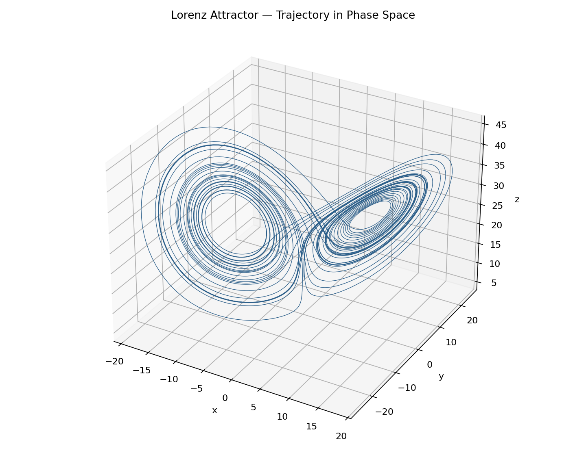
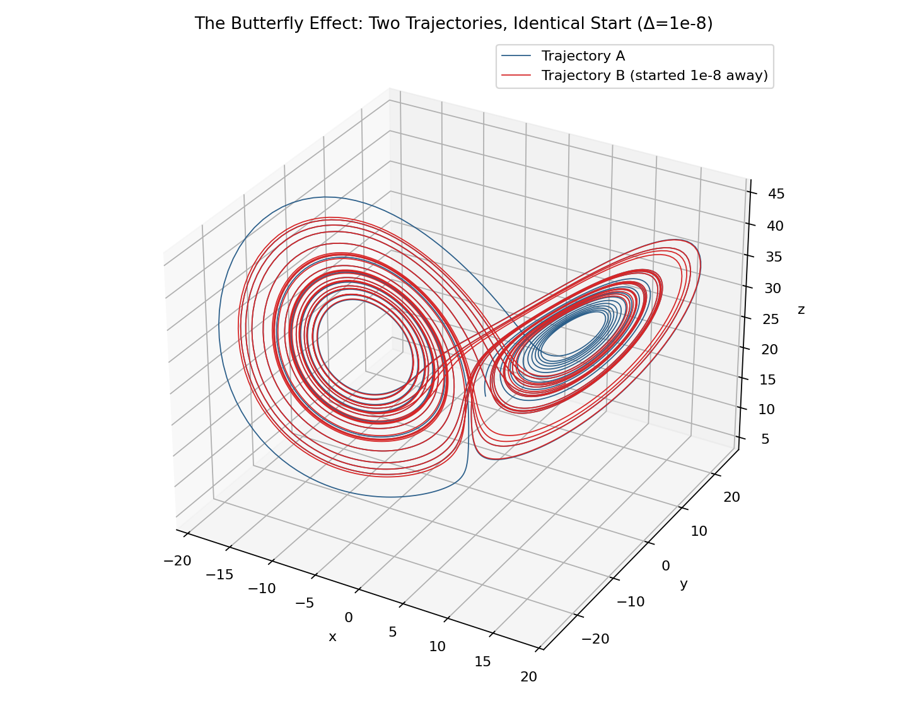
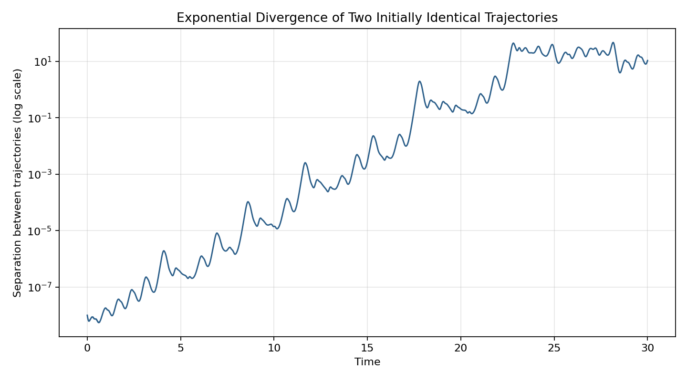
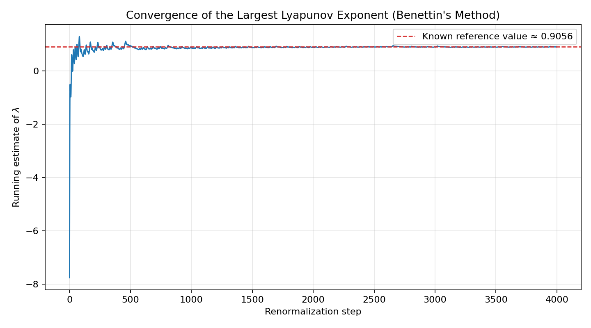

# Chaos in C: The Lorenz Attractor & the Butterfly Effect

Two small C programs (no external math libraries beyond `libm`) that simulate
the Lorenz system — the equations that gave us the term "the butterfly
effect" — and numerically compute its **Lyapunov exponent**, the number that
quantifies exactly how chaotic the system is.

## The system

```
dx/dt = sigma * (y - x)
dy/dt = x * (rho - z) - y
dz/dt = x * y - beta * z
```

With the classic parameters `sigma=10, rho=28, beta=8/3`, this simple-looking
set of three ODEs produces one of the most famous images in mathematics: a
bounded, never-repeating, deterministic trajectory shaped like a butterfly —
and a system so sensitive to initial conditions that two starting points
100-millionths of a unit apart end up in completely different parts of the
attractor within about 20 time units.

## Files

- `lorenz_chaos.c` — RK4-integrates one trajectory (for the attractor plot)
  and separately runs the **Benettin algorithm**: two trajectories `epsilon`
  apart, periodically rescaled back to `epsilon` after measuring how much
  they diverged, to compute the largest Lyapunov exponent `lambda`.
- `lorenz_divergence.c` — runs two trajectories `epsilon` apart with **no**
  rescaling, so you can watch the raw divergence happen and plot both paths.
- `plot_lorenz.py` — renders all four plots below from the CSVs the C
  programs produce.

## Build & run

```bash
gcc -O2 -o lorenz_chaos lorenz_chaos.c -lm
gcc -O2 -o lorenz_divergence lorenz_divergence.c -lm
./lorenz_chaos
./lorenz_divergence
python3 plot_lorenz.py     # needs pandas + matplotlib
```

## Result

This run's computed Lyapunov exponent:

```
lambda ~= 0.9032   (per unit time)
```

This matches the widely cited reference value for the classic Lorenz
parameters (~0.905), computed here from scratch via RK4 integration and
Benettin's renormalization method — no chaos libraries used.

### The attractor


### The butterfly effect: two trajectories, 1e-8 apart at t=0


### Their separation, growing exponentially (log scale)


### Lyapunov exponent converging to the known reference value


## Why this is more than "a cool fractal picture"

Plotting the attractor shape is easy and has been done a million times.
The Lyapunov exponent is the actual quantitative claim being made when
people say a system is "chaotic" — it's the rate at which prediction
becomes impossible. Computing it numerically requires:

1. A stable, accurate ODE integrator (RK4 here).
2. Tracking two nearby trajectories without them drifting apart so fast
   that floating-point precision breaks the measurement — hence the
   periodic rescaling in Benettin's method.
3. Averaging log-growth over thousands of renormalizations for the
   estimate to converge cleanly (see the convergence plot).

Getting a number within ~0.3% of the textbook reference value is a real
correctness check on the whole pipeline, not just a pretty picture.

## Possible extensions

- Compute the full Lyapunov *spectrum* (all three exponents, not just the
  largest) using QR-decomposition-based methods.
- Sweep `rho` and find the exact bifurcation point where the exponent
  crosses zero (the transition into chaos).
- Port the integrator to fixed-point arithmetic and see how much precision
  it costs the Lyapunov estimate — relevant if you care about control
  systems running on embedded hardware.
